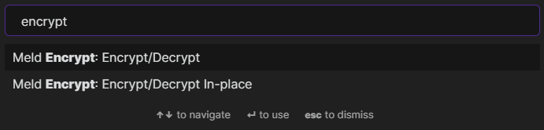
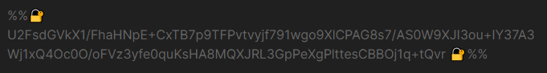
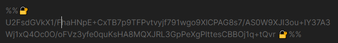
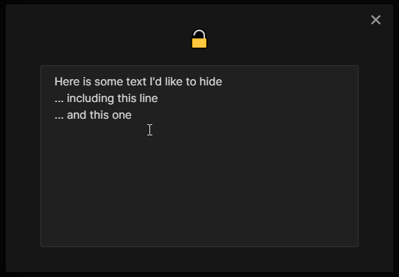

# Obsidian Encrypt Plugin

Hide secrets in your [Obsidian.md](https://obsidian.md/) vaults.

## Usage

### Encrypt text

1. Select the text to encrypt  

1. Run the Encrypt/Decrypt command from the palette (or bind a keyboard shortcut to it).  

1. Enter a password to use  

1. Result  

<!-- TODO: add gif -->

### Reveal encrypted text
1. With your cursor on the encrypted line  

1. Run the Encrypt/Decrypt command from the pallet.  

1. Enter the correct password  

1. Result  

<!-- TODO: add gif -->

<!-- ## Installation
You can install the plugin via the Community Plugins tab within Obsidian. Just search for "Encrypt" -->