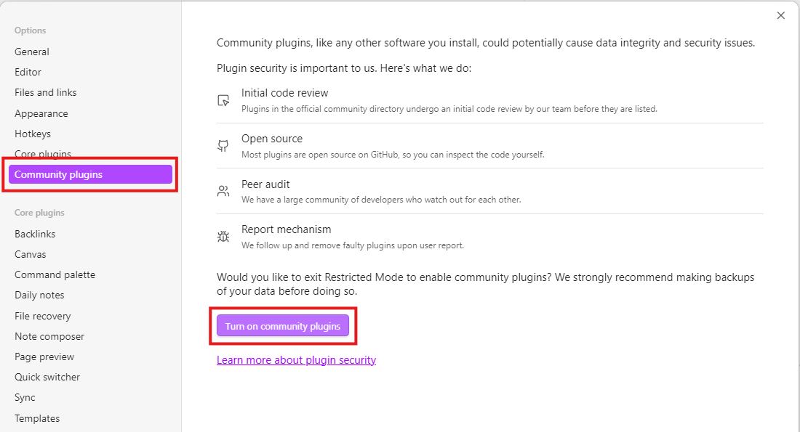
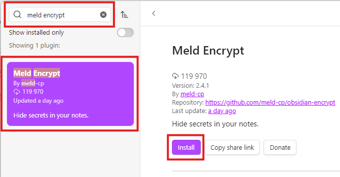
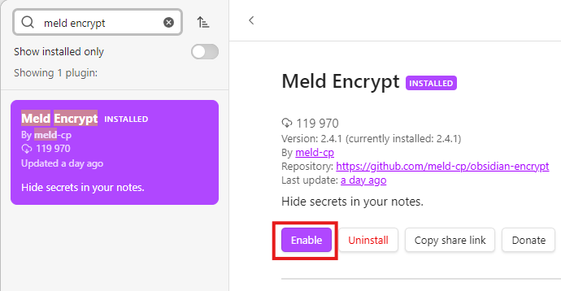

# Getting Started 

## Prerequisites 

You need to have Obsidian installed on your system. 

### Installing Obsidian (Windows)

1. Go to the [**Obsidian website**](https://obsidian.md/). 
2. Click **Get Obsidian for Windows**.
3. Download the installer and run it. 
4. Follow the on-screen instructions to complete installation.

## Installing the Obsidian Encrypt Plugin

To install the plugin:

1. Click the **Settings** icon in the bottom-left corner of Obsidian.

    

2. Select **Community plugins** and click **Turn on community plugins**.

    

3. Click the **Browse** button. 

    

4. Type **Meld Encrypt** in the search box. 
 
5. Select **Meld Encrypt** and click **Install**.

    

6. Click **Enable** to activate the **Meld Encrypt**.

    