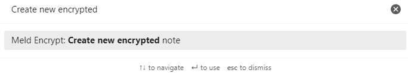
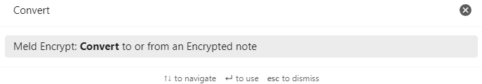
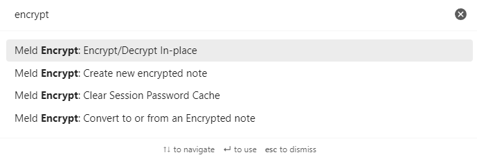
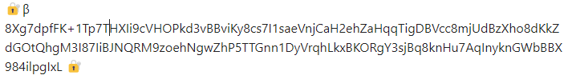
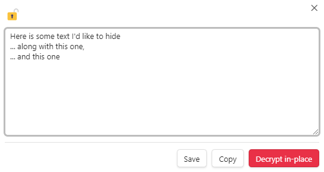

# User Guide 

You can use Obsidian Encrypt to create Whole Encrypted Notes or make In-place Encryptions. The following sections will guide you through each method.

## Whole Encrypted Notes

This feature opens a text window and saves your note to an encrypted `.mdenc` file.

### To Create a New Encrypted Note

**Option 1: Use the Command Palette**

1. Open the **Command pallete** by clicking the **Open command pallete** icon .
2. Type or scroll to **Create new encrypted note**, then select it.
   
3. Enter and confirm a password. You can add an optional password hint. 
4. Click **Confirm**.
5. Write your note in the text window. 
6. Click the **Lock & Close** icon  when done. 

**Option 2: Use the Ribbon Icon**

1. Click the **New encrypted note** icon. 
2. Enter and confirm a password. You can add an optional password hint. 
3. Click **Confirm**.
4. Write your note in the text window. 
5. Click **Lock & Close**  when done.

### To View or Edit an Encrypted Note

1. Go to **Files** by clicking the **Files** icon . 
2. Select the file with your encrypted note. 
3. Enter the correct password. 

### To Change an Encrypted Note's Password and Hint

1. Go to **Files** by clicking the **Files** icon .  
2. Select the file with your encrypted note. 
3. Enter the correct password. 
4. Click the **Change password** icon  from the tab menu or select the **Change Password** option from the context menu (to open the context menu click the **More options** icon). 
5. Enter and confirm a new password and an optional password hint.

### To Encrypt or Decrypt an Existing Note

**Option 1: Use the Right-Click Menu**

1. Go to **Files** by clicking the **Files** icon . 
2. Select and right-click the file with your encrypted note.
3. Select **Encrypt note** or **Decrypt note**.

**Option 2: Use the Ribbon Icon**

1. Go to **Files** by clicking the **Files** icon .
2. Select the file with your encrypted note. 
3. Click the **Convert to or from an Encrypted note** icon  to encrypt or decrypt the file.

**Option 3: Use the Command Palette**

1. Open the **Command pallete** by clicking the **Open command pallete** icon .
2. Type or scroll to **Convert to or from an Encrypted Note**, then select it.
   

## In-place Encryption

This feature lets you encrypt a selected text within your note.

### To Encrypt Selected Text

**Option 1: Use the Command Palette**

1. Go to **Files** by clicking the **Files** icon . 
2. Create a new note by clicking the **New note** icon  or select an existing one.
3. Select a text to encrypt. 
    > Note: A partial selection will be expanded to include the whole line if the **Expand selection to whole line** setting is enabled.
4. Open the **Command pallete** by clicking the **Open command pallete** icon .
5. Type or scroll to **Encrypt/Decrypt In-place**, then select it. 
   
6. Enter and confirm a password. You can add an optional password hint.
7. Click **Confirm**.

**Option 2: Use the Encrypt/Decrypt In-place icon**

1. Go to **Files** by clicking the **Files** icon . 
2. Create a new note by clicking the **New note** icon  or select an existing one.
3. Select a text to encrypt. 
    > Note: A partial selection will be expanded to include the whole line if the **Expand selection to whole line** setting is enabled.
4. Click the **Encrypt/Decrypt In-place** icon .
5. Enter and confirm a password. You can add an optional password hint.
6. Click **Confirm**.

### To Reveal or Decrypt Selected Text 

**Option 1: Use the Command Palette**

1. Go to **Files** by clicking the **Files** icon . 
2. Select the note with the encrypted text. 
3. Place your cursor anywhere on the encrypted text.
   
4. Open the **Command pallete** by clicking the **Open command pallete** icon .
5. Type or scroll to **Encrypt/Decrypt In-place**, then select it. 
   
6. Enter the correct password. 
   > Note: Your previously used password is filled in by default (you can change this in the plugin settings).
7. Your decrypted text appears in a dialog window. You can save it, copy the text, or click **Decrypt in-place** to decrypt the text directly in the note.
   
**Option 2: Use the Encrypt/Decrypt In-place icon**

1. Go to **Files** by clicking the **Files** icon . 
2. Select the note with the encrypted text. 
3. Place your cursor anywhere on the encrypted text.
   
4. Click the **Encrypt/Decrypt In-place** icon .
5. Enter the correct password. 
   > Note: Your previously used password is filled in by default (you can change this in the plugin settings).
6. Your decrypted text appears in a dialog window. You can save it, copy the text, or click **Decrypt in-place** to decrypt the text directly in the note.
   
   

